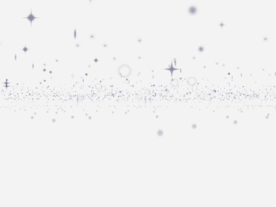

# 50 Days of Immersive Web

[Project Website](https://50days.netlify.app/)

50 days of immersive web is a personal challenge I am doing this summer. 
For one hour a day, I will try working with different immersive technologies that runs in the web browser, fail fast and find out what I really want to focus. 
I will also get rid of perfectionism and value quantity over quality, breadth over depth and consistency over intensity. 
The updated experiments will also be archived in [instagram](https://www.instagram.com/jeeyoonhyun/) and a [github repo](https://github.com/jeeyoonhyun/ImmersiveWeb).

### Project Goal
- Make 50 interactive mini websites including immersive elements: three.js, GLSL and WebGL
- Make a dedicated collage website where you can try the interactions

## [Day 7: Materialize](https://50days.netlify.app/day7)

Experimenting with react-three-fiber.

## [Day 6: Dithering](https://50days.netlify.app/day6)

Random noise & ordered dithering postprocessing shaders.
I used these resources: https://surma.dev/things/ditherpunk/ & https://github.com/hughsk/glsl-dither/blob/master/4x4.glsl .

## [Day 5: Custom Postprocessing](https://50days.netlify.app/day5)

Custom threshold shader combined with UnrealBloomPass.

## [Day 4: 10000](https://50days.netlify.app/day4)

10,000 particles moving in parallax.

* particle texture credits: Particle Pack by Kenney, downloaded from [kenney.nl/assets/particle-pack](kenney.nl/assets/particle-pack)

## [Day 3: Rotation](https://50days.netlify.app/day3)

I tried using the DeviceOrientation API. You can rotate the shape with your mobile device.

## [Day 2: Postprocessing](https://50days.netlify.app/day2)

Today I played around with making random shapes and applying the Bloom postprocessing effect on the scene.

## [Day 1: Diving](https://50days.netlify.app/day1)

* Typeface credit: Anthony by Sun Young Oh, downloded from Velvetyne Type Foundry