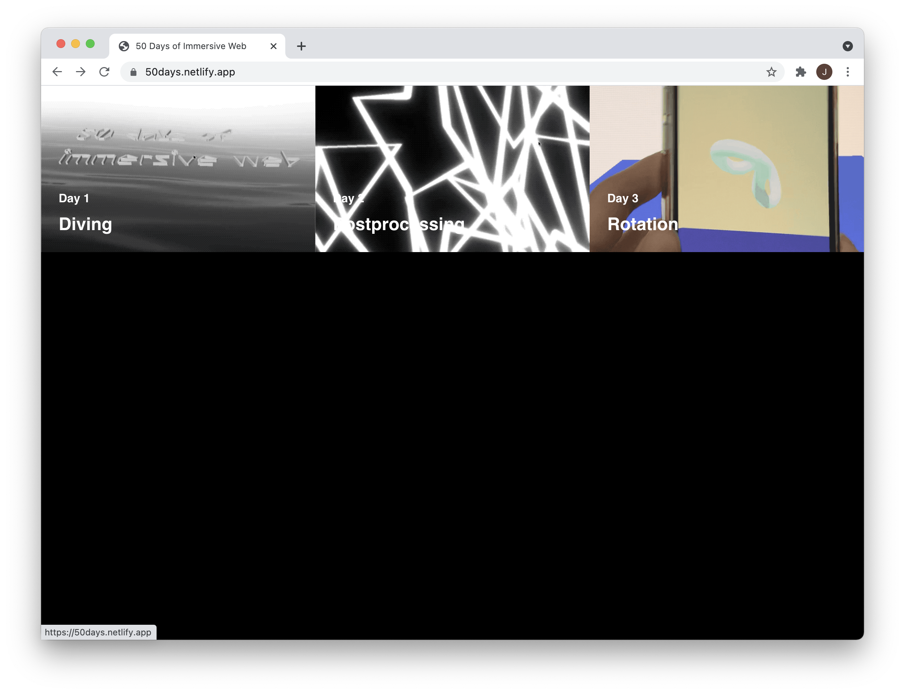

# 50 Days of Immersive Web

[Project Website](https://50days.netlify.app/)

50 days of immersive web is a personal challenge I am doing this summer. 
For one hour a day, I will try working with different immersive technologies that runs in the web browser, fail fast and find out what I really want to focus. 
I will also get rid of perfectionism and value quantity over quality, breadth over depth and consistency over intensity. 
The updated experiments will be archived in [instagram](https://www.instagram.com/jeeyoonhyun/) and also in a [github repo](https://github.com/jeeyoonhyun/ImmersiveWeb).

### Project Theme
- Make 50 interactive mini websites including immersive elements
    - three.js, GLSL and WebGL, Unity, WebXR
- Make a dedicated collage website where you can try the interactions
### Why did you choose this?
- Try different technologies on the web
- Fail fast and find out what I am interested/ what I want to dive deeper
### What will your routine be?
- Wake up at 9am and start working 1 hour everyday
- Upload whatever I have done for 1 hour

## [Day 1: Diving](https://50days.netlify.app/day1)

* Typeface credit: Anthony by Sun Young Oh, downloded from Velvetyne Type Foundry

## [Day 2: Postprocessing](https://50days.netlify.app/day2)

Today I played around with making random shapes and applying the Bloom postprocessing effect on the scene.

## [Day 3: Rotation](https://50days.netlify.app/day3)

I tried using the DeviceOrientation API. You can rotate the shape with your mobile device

